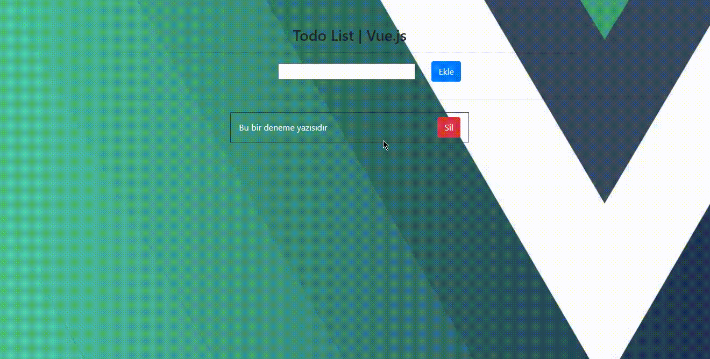

# Vue Todo List

[![Issues][issues-shield]][issues-url]
[![Contributors][contributors-shield]][contributors-url]
[![Forks][forks-shield]][forks-url]
[![Stargazers][stars-shield]][stars-url]
[![Language][language-shield]][language-url]


<p align="center">
    
</p>


## Project setup
```
npm install
```

### Compiles and hot-reloads for development
```
npm run serve
```

### Compiles and minifies for production
```
npm run build
```

### Lints and fixes files
```
npm run lint
```

### Customize configuration
See [Configuration Reference](https://cli.vuejs.org/config/).


[contributors-shield]: https://img.shields.io/github/contributors/buraaksenturk/vue-todo?style=for-the-badge
[contributors-url]: https://github.com/buraaksenturk/vue-todo/graphs/contributors
[forks-shield]: https://img.shields.io/github/forks/buraaksenturk/vue-todo?style=for-the-badge&color=purple
[forks-url]: https://github.com/buraaksenturk/vue-todo/network/members
[stars-shield]: https://img.shields.io/github/stars/buraaksenturk/vue-todo?style=for-the-badge&color=green
[stars-url]: https://github.com/buraaksenturk/vue-todo/stargazers
[issues-shield]: https://img.shields.io/github/issues/buraaksenturk/vue-todo?style=for-the-badge&color=yellow
[issues-url]: https://github.com/buraaksenturk/vue-todo/issues
[language-shield]: https://img.shields.io/github/languages/top/buraaksenturk/vue-todo?style=for-the-badge&color=darkgreen
[language-url]: https://github.com/vuejs
